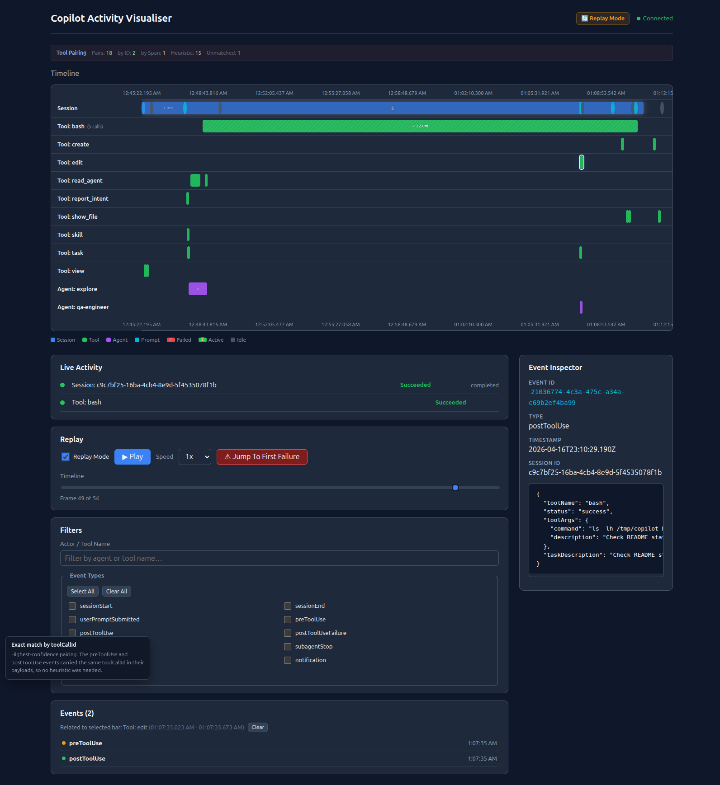
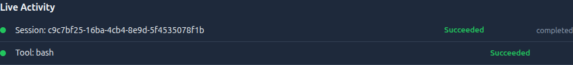

# Part 6: Putting It Together

Prev: [Part 5](part-5.md) | Up: [From Vanilla to Visualizer](../from-vanilla-to-visualizer.md)

## Final UI Checkpoint


By Part 6, the visualizer is showing the full pipeline working together:
pairing diagnostics, the timeline, the live activity board, replay controls,
filters, the event inspector, and a narrowed event list for the selected time
slice.


### The bootstrap command

Rather than asking users to manually create all these scripts, the visualizer
provides a one-command bootstrap:

```bash
npm run bootstrap:repo -- /path/to/your-repo --create-hooks
```

This generates:

| File | Purpose |
|------|---------|
| `.visualizer/emit-event.sh` | Bash emitter wrapper |
| `.visualizer/emit-event.ps1` | PowerShell emitter wrapper |
| `.visualizer/visualizer.config.json` | Configuration |
| `.visualizer/HOOK_INTEGRATION.md` | Integration guide |
| `.github/hooks/visualizer/*.sh` | Stub hook scripts (bash) |
| `.github/hooks/visualizer/*.ps1` | Stub hook scripts (PowerShell) |
| `.github/hooks/visualizer/visualizer-hooks.json` | Hook manifest |

Every generated stub is a full version of the enhanced scripts described in
this tutorial — with stdin extraction, field enrichment, conditional routing,
and emit-event integration baked in.

### Vanilla mode

If you want to start simple and add complexity incrementally, use the
`--vanilla` flag:

```bash
npm run bootstrap:repo -- /path/to/your-repo --create-hooks --vanilla
```

This generates minimal scripts that log the raw stdin JSON to a JSONL file —
identical to the [vanilla examples](../examples/vanilla-hooks/). No
transformations, no emit-event dependency, no enrichment. You can then layer
on features at your own pace using this tutorial as a guide.

### The full transformation at a glance

Here's the complete diff between a vanilla `pre-tool-use.sh` and the
enhanced version the visualizer generates:

**Vanilla (`pre-tool-use.sh`):**
```bash
#!/bin/bash
set -euo pipefail
# Vanilla pre-tool-use hook — logs the raw Copilot CLI payload.
# No transformations, no env var extraction, no fallback cascades.

INPUT=$(cat)

# Fields the Copilot CLI sends for preToolUse:
#   timestamp  — Unix timestamp in milliseconds
#   cwd        — Current working directory
#   toolName   — Name of the tool (e.g. "bash", "edit", "view", "create")
#   toolArgs   — JSON string containing the tool's arguments
TIMESTAMP=$(echo "$INPUT" | jq -r '.timestamp // empty')
TOOL_NAME=$(echo "$INPUT" | jq -r '.toolName // empty')
TOOL_ARGS=$(echo "$INPUT" | jq -r '.toolArgs // empty')
CWD=$(echo "$INPUT" | jq -r '.cwd // empty')

LOG_DIR=".github/hooks/logs"
mkdir -p "$LOG_DIR"

jq -n \
  --arg event "preToolUse" \
  --arg ts "$TIMESTAMP" \
  --arg tool "$TOOL_NAME" \
  --arg args "$TOOL_ARGS" \
  --arg cwd "$CWD" \
  '{event: $event, timestamp: $ts, toolName: $tool, toolArgs: $args, cwd: $cwd}' \
  >> "$LOG_DIR/events.jsonl"

# To deny a tool execution, output JSON with permissionDecision:
# echo '{"permissionDecision":"deny","permissionDecisionReason":"Blocked by policy"}'

exit 0
```

**Enhanced (50+ lines):**
```bash
#!/usr/bin/env bash
set -euo pipefail

SCRIPT_DIR="$(cd "$(dirname "${BASH_SOURCE[0]}")" && pwd)"
REPO_ROOT="$(cd "$SCRIPT_DIR/../../.." && pwd)"

# ── 35-line stdin extraction block ──
_VIZ_STDIN=$(cat 2>/dev/null || echo '{}')
_vjq() { echo "$_VIZ_STDIN" | jq -r "$1" 2>/dev/null || true; }
: "${TOOL_NAME:=$(_vjq '.toolName // empty')}"
: "${AGENT_NAME:=$(_vjq '.agent_name // .agentName // .agent.name // ...')}"
: "${TASK_DESC:=$(_vjq '.task_description // .taskDescription // ...')}"
# ... 20+ more field extractions ...

# ── Rich payload construction ──
_VIZ_PAYLOAD=$(jq -nc \
  --arg tool "$TOOL_NAME" \
  --arg agent "$AGENT_NAME" \
  --arg task "$TASK_DESC" \
  '{"toolName":$tool}
   + (if ($agent|length)>0 then {"agentName":$agent} else {} end)
   + (if ($task|length)>0 then {"taskDescription":$task} else {} end)')

# ── Emit via validated pipeline ──
if [ -x "${REPO_ROOT}/.visualizer/emit-event.sh" ]; then
  "${REPO_ROOT}/.visualizer/emit-event.sh" preToolUse "$_VIZ_PAYLOAD" "$SESSION_ID" >&2 || true
fi

exit 0
```

### What you've learned

| Part | Key Concept | Why It Matters |
|------|-------------|---------------|
| 1 | Vanilla hooks | Understand the baseline: what the CLI gives you for free |
| 2 | Schema & validation | Common envelope + Zod validation = reliable, versioned events |
| 3 | Payload enrichment | Stdin extraction + fallback cascades fill in missing context |
| 4 | Event synthesis | Split postToolUse; synthesize subagentStart from task metadata |
| 5 | Emit pattern | JSONL-first, HTTP-optional, redact-before-persist |
| 6 | Bootstrap | One command generates everything — vanilla or enhanced |

### Going further: Tracing v2

The visualiser now supports optional **event-stream correlation** — stamping
`turnId`, `traceId`, `spanId`, and `toolCallId` into event envelopes so the
ingest service can pair tool calls precisely rather than relying on FIFO
heuristics.

This is a purely additive, backward-compatible layer:
- Old JSONL logs without these fields continue to replay and pair via heuristic.
- New logs with these fields get exact pairing and richer inspector metadata.
- The web UI shows live pairing mode counts in the **Tool Pairing** bar.

See [Tracing Plan v2](../../roadmap/tracing-plan.md) for the full design and
[Hooked on Hooks — Lesson 9](../../hooked-on-hooks.md) for the practical takeaway.

### What the finished UI is showing

**Selected timeline window**



Selecting a Gantt segment narrows the event list to the corresponding time
window so you can inspect exactly which lifecycle records contributed to that
bar.

**Live activity board**



The live board gives you a compact current-state summary without needing to
scan the entire timeline.

**Replay controls**


Replay mode lets you scrub through persisted sessions, adjust playback speed,
and jump directly to the first failure.

**Event inspector**


When you click a timeline or event-list entry, the inspector exposes the raw
payload so you can validate enrichment, synthesis, and tracing metadata.

For a consolidated walkthrough of every captured UI surface, see the
[UI Feature Showcase](../ui-feature-showcase.md).

### Try it yourself

1. Bootstrap one repo with `--vanilla` and another without it.
2. Trigger the same short Copilot CLI workflow in both repos.
3. Compare generated hook scripts and resulting JSONL events.
4. Write down which layer differences matter most for your use case:
   validation, enrichment, synthesis, or transport.
5. Choose one next customization (for example, a new derived event or extra
   payload field) and implement it in one hook.

Useful compare commands:

```bash
# Compare one vanilla vs enhanced pre-tool-use hook
diff -u /path/to/vanilla-repo/.github/hooks/pre-tool-use.sh /path/to/enhanced-repo/.github/hooks/visualizer/pre-tool-use.sh

# Compare event type distribution between logs
jq -r '.eventType' /path/to/vanilla-repo/.github/hooks/logs/events.jsonl | sort | uniq -c
jq -r '.eventType' /path/to/enhanced-repo/.visualizer/logs/events.jsonl | sort | uniq -c
```

### Optional visualizer checkpoint

Run the optional checkpoint from [From Vanilla to Visualizer](../from-vanilla-to-visualizer.md).
At this final stage, the enhanced repo should provide the fullest live view:
validated envelopes, enriched payloads, and synthesized lifecycle events.

---

Prev: [Part 5](part-5.md) | Up: [From Vanilla to Visualizer](../from-vanilla-to-visualizer.md)
