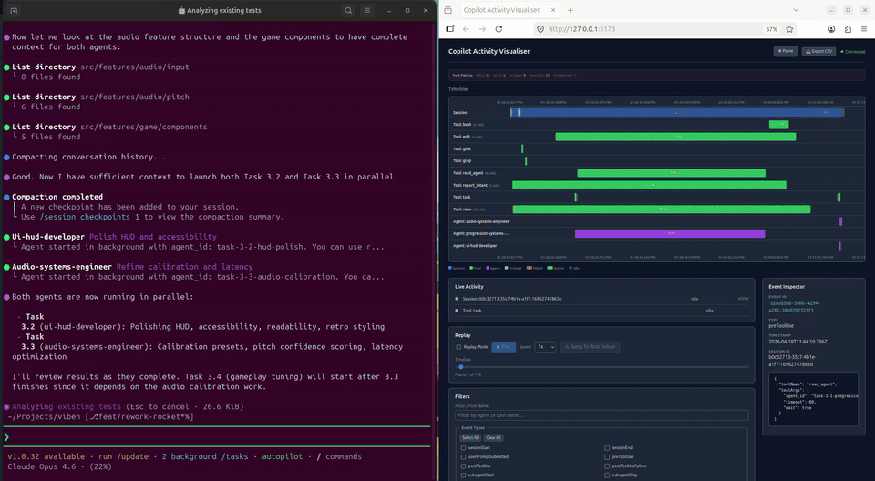

# Multi-Agent Build Visualization

This page captures a real multi-agent build and visualization run so you can see
how orchestration and UI feedback look end-to-end.

## Quick Preview (GIF)

## Full Recording (MP4)

<video controls preload="metadata" src="./assets/forge-and-vision.mp4" width="960">
  Your browser does not support the video tag.
</video>

If inline playback is unavailable in your viewer, open the direct files:

- [MP4 recording](./assets/forge-and-vision.mp4)
- [Original WebM](./assets/forge-and-vision.webm)

## What This Demonstrates

- Multi-agent orchestration flow from planning to implementation.
- Live visual updates as agent states and tool events evolve.
- A concrete artifact you can share when introducing the project workflow.
