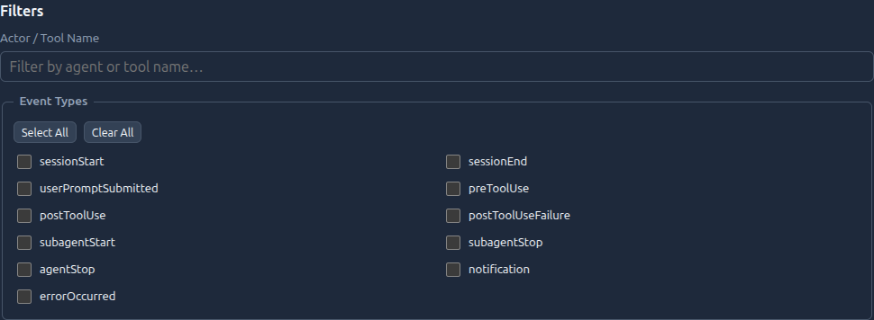

# UI Feature Showcase

This page collects the current tutorial-ready screenshots for the web UI so
other docs can reference one stable gallery instead of duplicating the same
explanations.

## Overview

The finished screen combines six surfaces that matter during investigation:
pairing diagnostics, the Gantt timeline, live activity, replay controls,
filtering, and the event inspector.

## Tool Pairing

The pairing bar summarizes how `preToolUse` and `postToolUse` events were
matched. `by ID` means the payload carried the same `toolCallId` on both
sides. `by Span` means `spanId` correlation was used. `Heuristic` means the
ingest service had to pair by tool name and arrival order.

## Timeline Selection

Clicking a Gantt bar highlights the selected period and narrows the event list
to records that occurred inside that window. This is the fastest way to pivot
from a visual spike to the exact underlying events.

## Live Activity

The live board shows the current top-level session state plus the most recent
tool rows, which is useful when you want a quick status read without opening a
specific event.

## Replay Controls

Replay mode reconstructs a session from persisted JSONL, supports speed
changes, and lets you jump directly to the first failure.

## Filters

Filters let you constrain the visible session by actor/tool name and by event
type, which is essential once richer synthesis starts producing more event
classes.

## Event Inspector

The inspector reveals the exact event payload selected from the timeline or
event list, making it the primary place to verify enrichment and tracing
metadata.